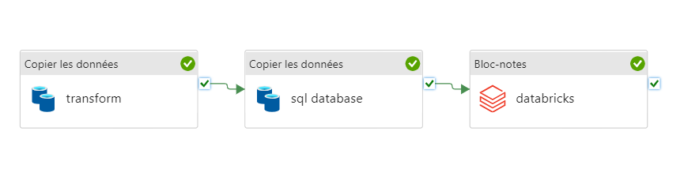
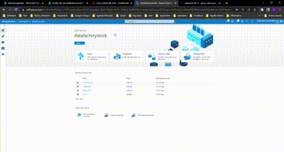

# Azure Storage Datalake / Data Integration / Data Pipeline

The objective of this repository is to build a data pipeline that will ingest data(stocks data) from a data lake, transform it and load it into a data warehouse. The data lake is a blob storage container that contains a set of files in CSV format. The data warehouse is a SQL database.  

Then we will couple Azure Databricks to the pipeline to perform some data analysis in a notebook taking data from Azure Data Warehouse.

## Architecture :  




## Steps :

- Step 1 : Create a script to upload the data from local to an azure storage account ( in our case a blob file container). The data are in CSV format and are stored in a folder called "stocks_data". The script will upload the data folder with its data into the storage account.  

Code : ``data_upload.py``  

```python
import os
import sys

from azure.storage.blob import BlobServiceClient

class DirectoryClient:
  def __init__(self, connection_string, container_name):
    service_client = BlobServiceClient.from_connection_string(connection_string)
    self.client = service_client.get_container_client(container_name)

  def upload(self, source, dest):
    '''
    Upload a file or directory to a path inside the container
    '''
    if (os.path.isdir(source)):
      self.upload_dir(source, dest)
    else:
      self.upload_file(source, dest)

  def upload_file(self, source, dest):
    '''
    Upload a single file to a path inside the container
    '''
    print(f'Uploading {source} to {dest}')
    with open(source, 'rb') as data:
      self.client.upload_blob(name=dest, data=data)

  def upload_dir(self, source, dest):
    '''
    Upload a directory to a path inside the container
    '''
    prefix = '' if dest == '' else dest + '/'
    prefix += os.path.basename(source) + '/'
    for root, dirs, files in os.walk(source):
      for name in files:
        dir_part = os.path.relpath(root, source)
        dir_part = '' if dir_part == '.' else dir_part + '/'
        file_path = os.path.join(root, name)
        blob_path = prefix + dir_part + name
        self.upload_file(file_path, blob_path)

# get the connection string from the environment
try:
  CONNECTION_STRING = os.environ['AZURE_STORAGE_CONNECTION_STRING']
except KeyError:
  print('AZURE_STORAGE_CONNECTION_STRING must be set')
  sys.exit(1)

# get the container name from the command line
try:
  CONTAINER_NAME = sys.argv[1]
except IndexError:
  print('usage: python data_upload.py CONTAINER_NAME  ')
  print('error: the following arguments are required: CONTAINER_NAME')
  sys.exit(1)

# Instantiate the DirectoryClient
client = DirectoryClient(CONNECTION_STRING, CONTAINER_NAME)

# Upload the stocks_data directory to Azure blob container
client.upload_dir('stocks_data', '')


```
To run the script, you need to install the requirements, set environment variables and do the following :
- Install requirements :
```shell
$ pip install -r requirements.txt
``` 

- Create a storage account in Azure and get the connection string. Then create a container in the storage account and get the container name. ( in our case the container name is "datalake").

- Set environment variables :

# [Windows](#tab/environment-variable-windows)

```cmd
setx AZURE_STORAGE_CONNECTION_STRING "<yourconnectionstring>"
```

# [Linux and macOS](#tab/environment-variable-linux)

```bash
export AZURE_STORAGE_CONNECTION_STRING="<yourconnectionstring>"
```

---


Then run the following command :
```shell
python data_upload.py datalake
```


- Step 2 : Create a Batch Activity in Azure Data Factory to transform all csv files in the data lake to a single file called "stocks_data.csv" and store the file in the data lake.

- Step 3 : Create a copy data activity in Azure Data Factory to copy the transformed file from the SQL datalake to a table called "stocks_data_copy" in the SQL database.

- Step 4 : Create a notebook in Azure Databricks to perform some data analysis on the data in the SQL database. And at the end of these analysis, we will store the results of the output in a Data Storage.

**Data :**
> 👉🏾Link : Get it  [here](https://drive.google.com/file/d/1F63LhH7LycfQPiFpjVTqg5mWe2t_YiLy/view) can be found in the stocks_data folder of the repository.
<br>  

**Tools :**
- Azure CLI
- Azure Storage Account
- Azure Data Factory
- Azure Data Lake
- Azure Databricks
- Azure SQL Database

**Demo of the pipeline :**  


